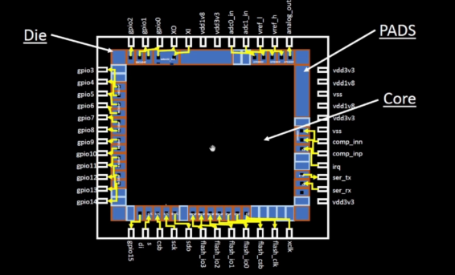
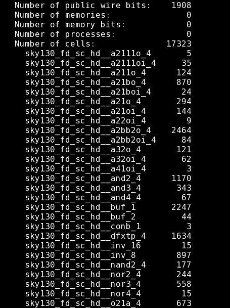
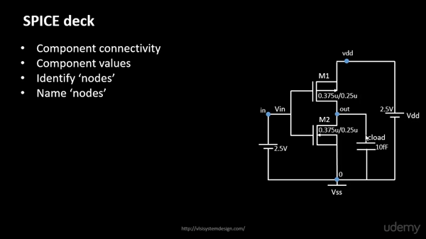
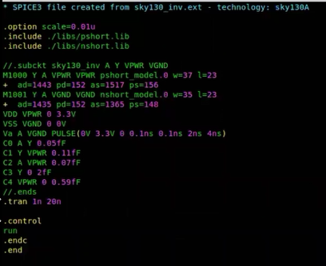

# vsd_IAT_openlane_workshop

It contains the material that was presented and learned in a 5 day workshop from 25 to 29 November conducted by Kunal Ghosh, co-founder of VLSI System Design (VSD) Corp. Pvt. Ltd. 

# Day 1:

The main learning objective of Day 1 are:

1. Getting familiarize with the terminology like core, package, IPs, Macros, Foundry.
2. A brief introduction to computer architecture, RISCV architecture, and how an application like stopwatch code in a high-level language is converted into binary language to be executed on hardware.
3. The 3 requirements to build an ASIC
4. The simplified RTL to GDSII flow 
5. Introduction to openlane
6. Passing the picorv32a design through the openlane flow and analyzing the synthesis result.

## Understanding:

### Termanologies:

#### Core:
When different small components like ALU, Registers, Instruction fetch are interconnected together to make a single block then that block is a core.

#### IPs:
When someone has used its intelligence in building an RTL design then that RTL design is an IP.
#### Macro:
The single-component of a large design is called macro.

#### Foundary:
A place where a digital design is manufactured.

The follownig snapshot shows different things in a package:

Top view of package         |  Internal of package
:--------------------------:|:-------------------------:
| 

### From software to hardware:

An algorithm is implemented in high level language like a code of sorting the number in decreasing order written in C++. This code written in a high-level language is given to the compiler which converts it into instruction, the syntax of these instruction depends upon the type of architecture that is used to develop the hardware. For example, in our case, RISCV architecture is used to write the RTL code from which the hardware is developed. The instruction from the compiler are fed to the assembler which convert them in binary number and these binary numbers are passed to hardware which do the working and display the result of written code. The below diagram shows this flow:

#### Requirements to build ASIC:

The three basic components required to build the ASIC are 

1. RTL code written in any HDL language 
2. EDA tools required to do the analysis, optimization, and generating the required files for the foundry
3. Process design kit PDK.
Now a days, there are a lot of open sources like opencores.org to get the RTL code, OpenLane for EDA tools, but for PDK there is only skywater-130 from skywater is available as open source. 

#### Simplified RTL to GDSII flow:

The following diagram shows the step from a design written in HDL to generate the GDSII file required by the foundry to build the physical layout

* Synth (synthesis)-> The standard cell library is used to convert the RTL code into a circuit.

* FF+PP (Floor and Power Planning) -> Planning the silicon area and develop the power distribution network.
* Place (Placement) -> Placing gate-level netlist on virtual rows. It is done in 2 steps Globel (optimal placing without any rules) and Detail (making global real by following rule with minimum alteration)
* CTS (Clock Tree Synthesis) -> Creating the clock distribution network following a structure like H, X hybrid of both H and X, etc.
* Route (Routing) -> Connecting the cells through the horizontal and vertical wire network
* Sign Off -> Making sure that layout and schematic are the same and performing the static timing analysis.

### OpenLane:
Openlane is an open-source tool that encompasses the open-source EDA tools to automate the flow from RTL to GDSII. it has public repo on Github. The below diagram shows the complete flow of Openlane.

The flow starts by feeding the RTL files with design constraints to yosys which translates it to into a logic circuit using generic components and then abc maps this circuit to cells. The OpenSTA do static timing analysis. Then OpenRoad apps are used to do the physical implementation. Again yosys is used to do the logic equivalence check (LEC). In the last, the static time analysis, design rule checking, and layout vs schematic checking is performed.

### Lab:
The lab task was to explore the directory structure of the openlane, take the picorv32a design, and pass it through the Oplenlane flow, and analyze the synthesis reports. The following blow diagram shows the synthesis report form which the flop ratio is calculated by dividing the number of flip-flops by the number of cells. Similarly, the total area can also be seen in the report

The below screenshots is showing the static timing time analysis and the result is confirming that the time requirements are met.

# Day 2

if we done step like floorplaning and want to change the some of the configuration for same step then first locate the variable in configuration files and do

            % set <copy variable from config file> <new value>
            % <run the command of step again>

# Day 3
Thi day is about designing a library cell using 2 tool i.e. Magic Layout and ngspice characterization

#### Spice simultion step:

The first step is preparation of Spice Deck which involves following things

Then from this information a spice simulation file is written for static and transition analysis. This file is passed to ngspice tool and simulation is run to draw the wavefrom. From the static analysis simulation waveform, we can zoom in to see threshold voltage and from transition anaylsis wavefrom the rise and fall times can be calculated.

#### 16-mask CMOS process:

The is the process of pysical impplementation of CMOS inverter.

**Steps:**

1 Selecting a substrate. Substrate is a material on which chip is fabricated.

2. Craeting the active region for transisters. The region of substrate where PMOS and CMOS is placed. 

3. N-well and P-well formation.

4. formation of gate.

5. Lightly Doped Drain formation.

6. Source drain formation.

7. local interact formation.

8. High metal formation.
  
The below diagram shows the result of above steps
  
  

# Lab

Following the step on this [github link](https://github.com/nickson-jose/vsdstdcelldesign) the following inverter layout is obtained
  
   
  
After this, extracting the file for spice simulation using the commands

            % extract all
            % ext2spice cthresh 0 rthresh 0
            $ ext2spice

After Modifying the extracted file, it look like this
  
  

Run the spice with command in clone directry

          $ ngspice <extracted file name>.spice

To see the output run this command in ngspice terminal
  
          ngspice 1 -> plot y vs time a
 
It will display the following kind of waveform:

  
